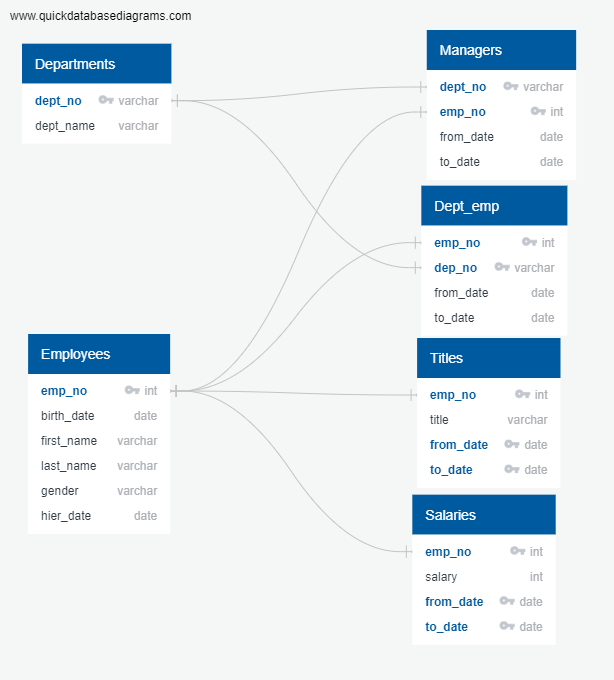

# Pewlett-Hackard Employee Analaysis

## Project Overview

Pewlett-Hackard is a large compnay with several thosand employees . The compnay has been around for long time and its workforce comprises of a large number of baby boomers. The HR has to been tasked to address these retierments by creating a plan for rucrutment and succession for upcoming vancant postiions due to retirements.

In order to do the above mentioned planning, HR employee data is used to identify following:
1. Determine the number of retiritng employees by different job titles, and the list of employees retiring with thier most recent job titles.
2. Identify list of employees meeting certain critrea who can participate in a mentorship program . The list of employee are eligible to participate in mentorship program where upcoming retiring employees provide mentor ship to these employees for the succession planning and replacement.

## Resources:
- HR Employee data set:
    - Entity relationship diagram for HR Employee data : 
     
     
- Link to sql to create database schema [Link to schema creation SQL](Queries/ph_employeedb_schema.sql)
- Link to data files:
    1. Data about Employees [Employees Data](Data/employees.csv)
    2. Data about departments [Departments Data](Data/departments.csv)
    3. Data about employees and department [Deptartment Employee](Data/dept_emp.csv)
    4. Data about employee's job titles during their tenure at the PH [Employee Titltes](Data/titles.csv)
    5. Data about employess salaries during their tenure at the PH [Employee Salaries](Data/salaries.csv)
    6. Data about department manages over time [Department Managers](Data/dept_manager.csv)
 - SQL code used to do the analysis is [SQL Code to analyze employee data](Queries/Employee_Database_challenge.sql)
 
 - Database : Postgress 11.6

## Analysis Results

#### Retiring employees title count:

1. The file [Retirement Titles](Data/retirement_titles.csv) shows all the titles held by employess who are reaching retirement baased on birth dates between Jan 1 1952 to Dec 31st 1955. Some of the employess have been long enough with company that they thave multiple changes in the job title during their tenure.e.g employee # 10004 was an engineer from Dec1 1986 to dec 1 1995 and then promoted to senior engineer thereafter .
        
         emp_no	first_name	last_name	title	from_date	to_date    
        10001	Georgi	Facello	Senior Engineer	6/26/1986	1/1/9999    
        10004	Chirstian	Koblick	Engineer	12/1/1986	12/1/1995    
        10004	Chirstian	Koblick	Senior Engineer	12/1/1995	1/1/9999      
    
    So we did the analysis using the latest titles for the retiring employees. The retiring employess with most recent titles are available in [Retiring Employess with latest title](Data/unique_titles.csv)
    
 2. There are only 2 employess with title "Manager" and more than 60% of the employess have "senior" level titles. Only 29% of employess seems to have a junior level title.

    count	title	            %of Total    
    29414	Senior Engineer	        33%    
    28254	Senior Staff	        31%    
    14222	Engineer	            16%    
    12243	Staff	                14%    
    4502	Technique Leader	    5%    
    1761	Assistant Engineer	    2%    
    2	    Manager	                0%    
    90398   Total		
    
 See the the file [Count of retirees by Title](Data/retiring_titles.csv) for above mentioned counts.

#### Employees eligible for mentorship program:

3. There are more 90,398 employess retiring , but for mentorship program we only have 1940 employess.  The list of employes eligible for mentorship program is provided in the file [Employees eligible for mentorship program](Data/mentorship_eligibilty.csv) 
    
4. No employess eligible for metnroship program currently held Manager title. 
    
    
## Summary:

1. There are 90,398 employess whose birth date is between Jan 1st, 1952 to Dec 31st, 1955. 
2. 60% of these upcoming retirment have senior positions.
3. HR idea to plan for mentorship using birthdate between Jan 1 165 and Dec 31st 1965 identified about 2K emploess eligible for mentorship program.
4. Lets use the year of date of birth to do financial planing for retirnemnt packages.

        SELECT to_char(birth_date,'YYYY') as year_of_birth,count( e.emp_no) as no_of_employess
        FROM employees e
        WHERE	birth_date between '1952-01-01' AND '1955-12-31'
        GROUP BY 1
        order by 1;
        year_of_birth   no_of_baby_boomers
        1952	        21209
        1953	        22857
        1954	        23228
        1955	        23104
        
5. Here is total salary by year of birth.

        select to_char(birth_date,'YYYY') as year_of_birth,sum(salary) as total_salary
        FROM (SELECT DISTINCT on (e.emp_no) e.emp_no, e.birth_date,s.salary
                FROM employees e
                left JOIN	salaries s
                ON	e.emp_no = s.emp_no
                WHERE	(birth_date between '1952-01-01' AND '1955-12-31')
                ORDER by e.emp_no , s.to_date DESC ) x
        GROUP BY 1
        order by 1;
        
        year_of_birth   total_salary
        1952	        1125796000
        1953	        1207017629
        1954	        1226016829
        1955	        1224053806

    
    
